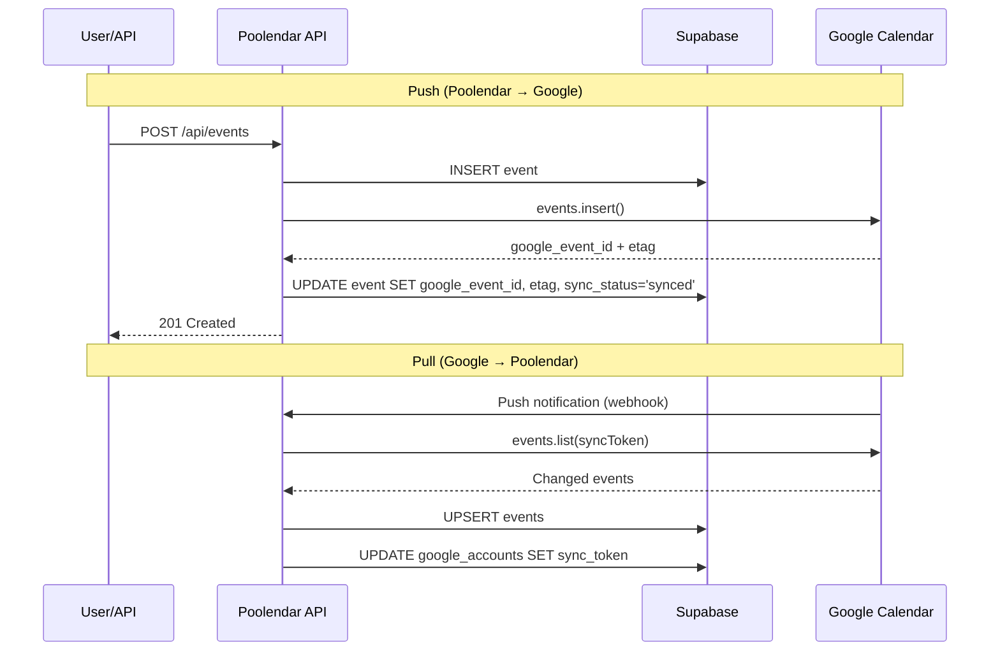
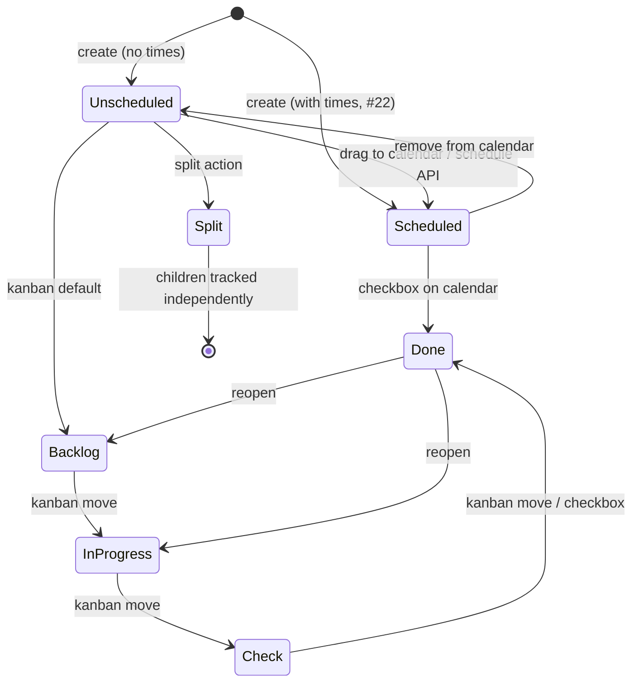

# TECH.md — Poolendar

## Context

Greenfield Next.js 14+ web app. No existing codebase — all architecture decisions are new. The product spec (`PRODUCT.md`) defines 90+ behavioral invariants across calendar grid, tasks with subtasks, routines, Google Calendar sync, booking pages, kanban board, and a 47-tool MCP server. The core thesis: `create_task` with `scheduled_start`/`scheduled_end` goes directly on the calendar grid (#22).

**Stack (confirmed in product spec):**
- **Next.js 14+** (App Router) — framework
- **Supabase** — auth, Postgres DB, realtime, storage, edge functions
- **Vercel** — hosting, edge middleware, cron
- **Cloudflare** — DNS, wildcard subdomain routing for booking pages

**Reference implementations studied:**
- A prior kanban build — @dnd-kit, fractional positioning, Current/Future boards, Supabase realtime
- cal.diy (MIT fork of Cal.com) — booking page patterns, availability pooling, embed code

**Key libraries:**
| Library | Purpose |
|---|---|
| `@dnd-kit/core` + `@dnd-kit/sortable` | Calendar drag + kanban drag |
| `@tanstack/react-query` | Server state, caching, optimistic mutations |
| `zustand` | UI-only state (view mode, panels, drag, undo stack) |
| `cmdk` | Command bar (⌘K) |
| `date-fns` | Date math (not moment.js) |
| `rrule` | RFC 5545 recurrence rule parsing/generation |
| `dexie` | IndexedDB wrapper for offline |
| `zod` | Input validation on all API routes |
| `@supabase/supabase-js` | Supabase client |
| `googleapis` | Google Calendar API (server-side only) |
| `resend` | Transactional email (booking confirmations, reminders) |
| `next-pwa` (Workbox) | Service worker for offline static caching |
| `tailwindcss` + `shadcn/ui` | Styling + component primitives |
| `sonner` | Toast notifications |
| `@modelcontextprotocol/sdk` | MCP server (separate package) |

## Proposed Changes

### 1. Supabase Schema

12 tables. All tables have RLS policies restricting access to `auth.uid() = user_id`. Booking-related tables have additional public-read/insert policies for external bookers.

```sql
-- Extends Supabase auth.users
create table profiles (
  id uuid primary key references auth.users(id),
  username text unique not null,          -- booking subdomain
  display_name text,
  company text,
  avatar_url text,
  settings jsonb default '{}',           -- all General settings (#68) as JSON
  created_at timestamptz default now(),
  updated_at timestamptz default now()
);

-- Multiple Google accounts per user
create table google_accounts (
  id uuid primary key default gen_random_uuid(),
  user_id uuid references profiles(id) on delete cascade,
  email text not null,
  access_token text not null,            -- encrypted via pgcrypto
  refresh_token text not null,           -- encrypted
  token_expires_at timestamptz not null,
  sync_token text,                       -- Google incremental sync token
  last_synced_at timestamptz,
  created_at timestamptz default now(),
  unique(user_id, email)
);

-- Cached from Google Calendar API
create table calendars (
  id uuid primary key default gen_random_uuid(),
  user_id uuid references profiles(id) on delete cascade,
  google_account_id uuid references google_accounts(id) on delete cascade,
  google_calendar_id text not null,
  name text not null,
  color text not null,                   -- hex
  is_primary boolean default false,
  is_active boolean default true,
  access_role text,                      -- owner | writer | reader
  created_at timestamptz default now(),
  updated_at timestamptz default now(),
  unique(google_account_id, google_calendar_id)
);

-- Bidirectional sync with Google Calendar
create table events (
  id uuid primary key default gen_random_uuid(),
  user_id uuid references profiles(id) on delete cascade,
  calendar_id uuid references calendars(id) on delete cascade,
  google_event_id text,                  -- null during offline creation
  title text not null,
  notes text,
  start_time timestamptz not null,
  end_time timestamptz not null,
  timezone text default 'America/New_York',
  is_all_day boolean default false,
  location text,
  color_override text,                   -- per-event hex override (#15a)
  visibility text default 'busy',
  privacy text default 'public',
  conferencing_url text,
  recurrence_rule text,                  -- RRULE string
  recurrence_id text,                    -- instance ID for recurring exceptions
  attendees jsonb default '[]',
  reminders jsonb default '[]',
  status text default 'confirmed',
  sync_status text default 'synced',     -- synced | pending_push | conflict
  etag text,                             -- Google ETag for conflict detection
  created_at timestamptz default now(),
  updated_at timestamptz default now()
);

-- Poolendar-only, NOT synced to Google (#49)
create table tasks (
  id uuid primary key default gen_random_uuid(),
  user_id uuid references profiles(id) on delete cascade,
  calendar_id uuid references calendars(id),
  parent_id uuid references tasks(id) on delete set null,
  title text not null,
  notes text,
  importance text default 'normal',      -- lowest|low|normal|high|highest
  time_estimate_minutes int,
  earliest_start date,
  due_date date,
  due_date_recurrence text,
  scheduled_start timestamptz,           -- planned calendar slot (#22)
  scheduled_end timestamptz,
  location text,
  visibility text default 'busy',
  privacy text default 'private',
  flexibility text default 'flexible',
  status text default 'backlog',         -- backlog|in_progress|check|done
  board text default 'current',          -- current|future
  is_split boolean default false,
  completed_at timestamptz,
  position float8,                       -- fractional kanban ordering
  reminders jsonb default '[]',
  created_at timestamptz default now(),
  updated_at timestamptz default now()
);

-- Checklist items within a task (#23a)
create table subtasks (
  id uuid primary key default gen_random_uuid(),
  task_id uuid references tasks(id) on delete cascade,
  title text not null,
  time_estimate_minutes int,
  completed boolean default false,
  position float8 not null,
  created_at timestamptz default now()
);

create table tags (
  id uuid primary key default gen_random_uuid(),
  user_id uuid references profiles(id) on delete cascade,
  name text not null,
  color text not null,
  prefix text,
  created_at timestamptz default now(),
  unique(user_id, name)
);

create table task_tags (
  task_id uuid references tasks(id) on delete cascade,
  tag_id uuid references tags(id) on delete cascade,
  primary key (task_id, tag_id)
);

create table routines (
  id uuid primary key default gen_random_uuid(),
  user_id uuid references profiles(id) on delete cascade,
  calendar_id uuid references calendars(id),
  title text not null,
  notes text,
  start_time time not null,              -- time of day, not timestamptz
  end_time time not null,
  timezone text default 'America/New_York',
  recurrence_rule text not null,
  location text,
  visibility text default 'busy',
  privacy text default 'private',
  reminders jsonb default '[]',
  created_at timestamptz default now(),
  updated_at timestamptz default now()
);

-- Per-day state for routine occurrences (#26, #27)
create table routine_instances (
  id uuid primary key default gen_random_uuid(),
  routine_id uuid references routines(id) on delete cascade,
  date date not null,
  status text default 'pending',         -- pending|completed|skipped
  completed_at timestamptz,
  override_start_time time,              -- "only this occurrence" edits (#28a)
  override_end_time time,
  override_title text,
  unique(routine_id, date)
);

create table booking_links (
  id uuid primary key default gen_random_uuid(),
  user_id uuid references profiles(id) on delete cascade,
  slug text not null,
  name text not null,
  duration_minutes int not null,
  availability jsonb not null,           -- [{day, start, end}]
  timezone text default 'America/New_York',
  google_account_id uuid references google_accounts(id),
  conferencing boolean default true,
  location text,
  notes text,
  is_public boolean default true,
  requires_approval boolean default false,
  buffer_minutes int default 0,
  minimum_notice_hours int default 0,
  created_at timestamptz default now(),
  updated_at timestamptz default now(),
  unique(user_id, slug)
);

create table bookings (
  id uuid primary key default gen_random_uuid(),
  booking_link_id uuid references booking_links(id) on delete cascade,
  booker_name text not null,
  booker_email text not null,
  booker_notes text,
  start_time timestamptz not null,
  end_time timestamptz not null,
  status text default 'confirmed',       -- pending|confirmed|cancelled|rescheduled
  google_event_id text,
  cancel_token text unique default gen_random_uuid(),
  created_at timestamptz default now()
);

create table api_keys (
  id uuid primary key default gen_random_uuid(),
  user_id uuid references profiles(id) on delete cascade,
  name text not null,
  key_hash text not null,                -- bcrypt
  key_prefix text not null,              -- first 8 chars: "pk_abc12..."
  last_used_at timestamptz,
  created_at timestamptz default now()
);

-- Placeholder for future auto-scheduling
create table schedules (
  id uuid primary key default gen_random_uuid(),
  user_id uuid references profiles(id) on delete cascade,
  name text not null,
  time_blocks jsonb not null,
  created_at timestamptz default now(),
  updated_at timestamptz default now()
);
```

**Indexes:**
- `events(user_id, start_time, end_time)` — calendar grid queries
- `tasks(user_id, status, board)` — kanban queries
- `tasks(parent_id)` — subtask lookups
- `subtasks(task_id, position)` — ordered subtask lists
- `routine_instances(routine_id, date)` — daily instance lookups
- `bookings(booking_link_id, start_time, end_time)` — availability checks
- `events(google_event_id)` — sync lookups

### 2. App Structure

```
app/
├── (auth)/
│   ├── login/page.tsx
│   └── callback/route.ts           # Supabase Auth callback
├── (app)/
│   ├── layout.tsx                  # SidebarRibbon + top bar
│   ├── page.tsx                    # Calendar grid (default)
│   ├── settings/page.tsx           # Settings modal
│   └── booking/page.tsx            # Booking management panel
├── (booking)/                      # External booking pages (public)
│   └── [slug]/page.tsx
├── api/
│   ├── calendars/route.ts
│   ├── events/route.ts
│   ├── events/[id]/route.ts
│   ├── events/[id]/rsvp/route.ts
│   ├── tasks/route.ts
│   ├── tasks/[id]/route.ts
│   ├── tasks/[id]/complete/route.ts
│   ├── tasks/[id]/reopen/route.ts
│   ├── tasks/[id]/move/route.ts
│   ├── tasks/[id]/split/route.ts
│   ├── tasks/[id]/schedule/route.ts
│   ├── tasks/[id]/subtasks/route.ts
│   ├── tasks/[id]/subtasks/[subtaskId]/route.ts
│   ├── tasks/[id]/subtasks/reorder/route.ts
│   ├── tasks/reflow/route.ts
│   ├── routines/route.ts
│   ├── routines/[id]/route.ts
│   ├── routines/[id]/instances/[date]/complete/route.ts
│   ├── routines/[id]/instances/[date]/skip/route.ts
│   ├── booking/links/route.ts
│   ├── booking/links/[id]/route.ts
│   ├── booking/links/[id]/bookings/route.ts
│   ├── booking/availability/[slug]/route.ts
│   ├── booking/book/[slug]/route.ts
│   ├── tags/route.ts
│   ├── tags/[id]/route.ts
│   ├── schedules/route.ts
│   ├── schedules/[id]/route.ts
│   ├── convert/route.ts
│   ├── search/route.ts
│   ├── auth/api-keys/route.ts
│   └── webhooks/
│       └── google-calendar/route.ts
├── middleware.ts                    # Subdomain routing + API key auth
components/
├── calendar/
│   ├── CalendarGrid.tsx            # Main grid container
│   ├── TimeGrid.tsx                # Vertical time slots
│   ├── DayColumn.tsx               # Single day column
│   ├── AllDayRow.tsx               # All-day events row
│   ├── EventBlock.tsx              # Solid-fill event rendering
│   ├── TaskBlock.tsx               # Dashed-border task rendering
│   ├── RoutineBlock.tsx            # Dashed-border + repeat icon
│   ├── PreviewPopover.tsx          # Single-click popover (#15)
│   ├── ItemEditForm.tsx            # Tabbed edit form (#13)
│   ├── SubtaskChecklist.tsx        # Inline subtask editor (#23c)
│   ├── ViewModeSelector.tsx        # Day/Week/Month/Custom dropdown (#4)
│   └── ContextMenu.tsx             # Right-click menus (#15a, #15b)
├── sidebar/
│   ├── SidebarRibbon.tsx           # Narrow icon rail (#72)
│   ├── TaskPanel.tsx               # Task list with groups (#28-36)
│   ├── RoutinePanel.tsx            # Routine list (#31)
│   └── BookingPanel.tsx            # Booking link management (#52)
├── kanban/
│   ├── Board.tsx                   # Full kanban view (#36-43)
│   ├── Column.tsx                  # Single column
│   ├── Tile.tsx                    # Task card with subtask progress
│   └── BoardToggle.tsx             # Current/Future switch (#38)
├── command-bar/
│   └── CommandBar.tsx              # ⌘K overlay (#72a-72c)
├── booking-external/
│   ├── BookingPage.tsx             # External booking UI (#57b)
│   ├── DatePicker.tsx
│   └── SlotPicker.tsx
├── settings/
│   ├── SettingsModal.tsx
│   ├── GeneralSettings.tsx
│   ├── CalendarSettings.tsx
│   ├── TagSettings.tsx
│   ├── BookingSettings.tsx
│   └── ProfileSettings.tsx
└── ui/                             # shadcn/ui primitives
lib/
├── supabase/
│   ├── client.ts                   # Browser client
│   ├── server.ts                   # Server client
│   └── middleware.ts               # Auth middleware helper
├── google/
│   ├── auth.ts                     # OAuth flow for multiple accounts
│   ├── calendar.ts                 # Calendar API wrapper
│   └── sync.ts                     # Push/pull sync logic
├── hooks/
│   ├── useEvents.ts                # TanStack Query hooks
│   ├── useTasks.ts
│   ├── useSubtasks.ts
│   ├── useRoutines.ts
│   ├── useBooking.ts
│   ├── useTags.ts
│   ├── useCalendars.ts
│   ├── useUndoRedo.ts              # Command pattern undo stack
│   ├── useKeyboardShortcuts.ts
│   ├── useOfflineQueue.ts          # IndexedDB mutation queue
│   └── useDragCalendar.ts          # Calendar grid drag logic
├── stores/
│   ├── calendar-store.ts           # View mode, selected date, selected item
│   ├── panel-store.ts              # Which panels are open
│   └── undo-store.ts               # Operation stack (50 deep)
├── utils/
│   ├── availability.ts             # Booking availability calculation
│   ├── recurrence.ts               # rrule wrapper
│   ├── fractional-index.ts         # Kanban ordering
│   ├── time.ts                     # Grid position ↔ time conversion
│   └── color.ts                    # Calendar color utilities
└── validators/
    ├── event.ts                    # Zod schemas
    ├── task.ts
    ├── routine.ts
    ├── booking.ts
    └── tag.ts
```

### 3. Google Calendar Sync

**Multiple accounts:** Supabase Auth handles Poolendar login (Google SSO or email/password). Google Calendar connections are separate OAuth flows — each connected account stores tokens in `google_accounts`. This decouples login identity from calendar access (#44, #47).

**OAuth flow:**
1. User clicks "Connect calendars" → redirect to Google OAuth consent screen with `calendar.events`, `calendar.readonly`, `calendar.settings.readonly` scopes
2. Callback stores `access_token`, `refresh_token`, `token_expires_at` in `google_accounts`
3. Fetch calendar list → populate `calendars` table
4. Initial event sync → fetch events for past 30 days + next 365 days → insert into `events`

**Push (Poolendar → Google):**
1. API route creates/updates/deletes event in Supabase
2. Same request handler calls Google Calendar API
3. On success: store `google_event_id` + `etag`, set `sync_status = 'synced'`
4. On failure: set `sync_status = 'pending_push'`, Vercel Cron retries every 2 minutes (max 5 retries with exponential backoff)

**Pull (Google → Poolendar):**
1. On account connection: register Google Calendar webhook via `watch` endpoint (7-day TTL)
2. Google push notification hits `/api/webhooks/google-calendar` → call `events.list` with `syncToken` for incremental changes → upsert into `events`
3. Vercel Cron re-registers webhooks every 6 days (before TTL expiry)
4. Fallback: Vercel Cron polls `events.list` with `syncToken` every 5 minutes for any account whose webhook hasn't fired in 10+ minutes

**Token refresh:** Middleware checks `token_expires_at` before every Google API call. If expired, refresh via Google's token endpoint, update `google_accounts` row. If refresh fails (token revoked), mark account as disconnected and surface in UI.

**Conflict handling:** ETag-based. Before Google API update, compare stored `etag` with current. On mismatch: fetch latest from Google, apply last-write-wins merge per field, push merged result back.

### 4. Authentication & API Keys

**Browser sessions:** Supabase Auth with `@supabase/ssr` for cookie-based sessions. Middleware validates session on every `(app)/` route.

**API keys (#92):** Generated in Settings > Profile. Key format: `pk_` + 32 random hex chars. Stored as bcrypt hash in `api_keys`. Key shown once on creation.

**API auth middleware** (`middleware.ts`):
```
if (request.nextUrl.pathname.startsWith('/api/')) {
  // Check Authorization: Bearer pk_... header
  // Hash provided key, compare against api_keys table
  // Set user context for downstream handlers
}
```

**Rate limiting (#78):** Vercel Edge middleware with sliding window counter per API key. 1,000 reads/min, 100 writes/min. Returns `429` with `Retry-After` header.

### 5. Calendar Grid Rendering

Custom-built, no calendar library. The grid is a CSS Grid with positioned absolute blocks.

**Layout:** `TimeGrid` renders 24 (or configured range) hour rows. Each `DayColumn` is a `position: relative` container. `EventBlock`/`TaskBlock`/`RoutineBlock` are `position: absolute` children positioned by:
```
top = (startMinutes / totalMinutes) * 100%
height = (durationMinutes / totalMinutes) * 100%
```

**Overlap (#15c):** When blocks overlap, calculate overlap groups. Within a group, each block gets `width = 100% / groupSize` and `left = index * (100% / groupSize)`.

**Zoom (#8):** `]`/`[` scales the row height multiplier in `calendar-store`. CSS custom property `--hour-height` controls the visual scale. Scroll position preserved around the current viewport center.

**Drag interactions (#14):** @dnd-kit with custom collision detection. Vertical drag snaps to time-dragging resolution (default 15min). Horizontal drag snaps to day columns. Bottom-edge drag (resize) uses a separate drag handle. All drags produce optimistic UI updates via TanStack Query's `onMutate`.

**Month view (#9a):** CSS Grid with 7 columns × 5-6 week rows. Day cells show max N items (based on cell height), "+N more" link opens a popover with all items for that day.

### 6. Task Lifecycle & Subtasks

**State machine:**
```
Inbox (no scheduled_start) ──drag-to-calendar──→ Scheduled
        │                                            │
        ├──────── kanban move ──→ In Progress ──→ Check ──→ Done
        │                              │                      │
        └──────────────────────────────┴──── reopen ──────────┘
```

**Subtask model (#23a-23g):**
- `subtasks` table holds checklist items (title, optional `time_estimate_minutes`, `completed`, `position`)
- Parent task's calendar block duration = `SUM(subtask estimates)` when subtask estimates exist, else parent's own `time_estimate_minutes`, else default from settings (#23b)
- Subtasks without custom estimates → `parent_duration / n` each

**Split operation (#23d):**
1. For each `subtasks` row: create a new `tasks` row with `parent_id` set, inheriting parent's tags/project/importance
2. Each child gets `time_estimate_minutes` from its subtask estimate (or `parent_duration / n`)
3. Set parent's `is_split = true`
4. Delete all `subtasks` rows (they're now full tasks)
5. Parent no longer appears on calendar — only children do (#23e)

**Split without existing subtasks (#23g):** Prompt for N. Create N child tasks with `time_estimate_minutes = parent_duration / N`. Parent marked `is_split = true`.

### 7. Undo/Redo System

Two mechanisms coexist per PRODUCT.md #72d-72f:

**Grace period (30s delayed execution):** Destructive operations (delete, complete, move) don't immediately hit the API. They apply optimistically to the UI and enter a pending queue. A persistent toast shows countdown + Undo button. After 30 seconds, the API call fires. Undo within the window cancels the operation and restores the previous state.

**Operation stack (command pattern):** `undo-store` (Zustand) maintains a stack of `{type, entityType, entityId, previousState, newState}` objects, max depth 50. `⌘Z` pops the stack and applies `previousState` via API. `⌘⇧Z` pushes to redo stack and applies `newState`. Stack clears on page refresh (#72f).

### 8. Booking Page Architecture

**Subdomain routing:** Vercel wildcard domain `*.poolendar.com`. Next.js middleware detects subdomain:
```
const hostname = request.headers.get('host')
const subdomain = hostname.split('.')[0]
if (subdomain !== 'app' && subdomain !== 'www' && subdomain !== 'poolendar') {
  return NextResponse.rewrite(new URL(`/(booking)/${request.nextUrl.pathname}`, request.url), {
    headers: { 'x-booking-username': subdomain }
  })
}
```

**Availability calculation (#56):**
1. Get booking link's weekly availability grid
2. For the requested date: find matching day-of-week slots
3. Subtract: existing events (from Google Calendar API for the linked account), existing bookings (from `bookings` table), buffer time before/after each booking
4. Apply minimum notice filter (exclude slots within `minimum_notice_hours` of now)
5. Return available time slots as `{start, end}` pairs

**Booking confirmation (#57a):** Supabase Edge Function triggers on `bookings` insert → creates Google Calendar event on host's calendar → sends Resend email to booker (with ICS attachment + cancel/reschedule links) and host (with booking details). Cancel/reschedule links include the `cancel_token` for auth-free access.

### 9. Offline Strategy

**Static caching:** next-pwa (Workbox) caches app shell, JS bundles, and fonts. Stale-while-revalidate for API responses.

**Data caching:** Dexie IndexedDB stores mirror tables: `events`, `tasks`, `subtasks`, `routines`, `routine_instances`, `calendars`. Populated on initial load, updated via Supabase Realtime subscriptions.

**Mutation queue:** When offline, mutations write to a Dexie `mutation_queue` table: `{id, method, url, body, timestamp}`. On reconnect, queue drains in order. Failures retry 3x with backoff, then surface as a persistent error banner.

**Conflict resolution (#72j):** Last-write-wins by `updated_at` timestamp. If server version is newer AND local version has changes, merge field-by-field (non-null local fields overwrite). If entity was deleted server-side while modified locally, show resolution prompt.

### 10. Notifications

| Channel | Implementation |
|---|---|
| Browser push | Web Push API + service worker. Subscription stored in Supabase. Edge Function sends via `web-push`. |
| Email | Resend API from Edge Functions. React Email templates. |
| In-app | Supabase Realtime `notifications` channel → Sonner toast. |
| Telegram | Edge Function calls Telegram Bot API (`sendMessage`). Bot token + chat ID from `profiles.settings`. |

**Triggers:** Vercel Cron runs every minute, queries for items with reminders due in the next minute. Fires notifications per channel per user preference (#63).

### 11. MCP Server

Separate npm package: `poolendar-mcp`.

```
poolendar-mcp/
├── src/
│   ├── index.ts              # Server entry, tool registration
│   ├── client.ts             # REST API wrapper (fetch + API key auth)
│   └── tools/
│       ├── calendars.ts      # list_calendars
│       ├── events.ts         # CRUD + rsvp
│       ├── tasks.ts          # CRUD + close/reopen/move/split/schedule
│       ├── subtasks.ts       # CRUD + complete
│       ├── routines.ts       # CRUD + instance complete/skip
│       ├── booking.ts        # links CRUD + list_bookings
│       ├── tags.ts           # CRUD
│       ├── convert.ts        # type conversion (6 directions)
│       ├── search.ts         # full-text search
│       └── schedules.ts      # placeholder CRUD
├── package.json
└── tsconfig.json
```

Installation: `claude mcp add poolendar -- npx poolendar-mcp`

Config reads `POOLENDAR_API_KEY` from environment. Each tool has a rich `description` field optimized for LLM tool selection — e.g., `create_task` description explicitly states that `scheduled_start`/`scheduled_end` place the task on the calendar grid (#82).

Tool count: 15 Morgen-parity + 32 Poolendar-exclusive = 47 total.

## Diagrams

### Google Calendar Sync Flow



### Task Lifecycle State Machine



## Testing and Validation

Tests map directly to PRODUCT.md invariant numbers.

### Unit Tests (Vitest)

| Module | Covers invariants | Tests |
|---|---|---|
| `utils/availability.ts` | #56 | Booking pool overlap, buffer time subtraction, minimum notice filter |
| `utils/recurrence.ts` | #28a | RRULE parsing, instance generation, "this & future" exception creation |
| `utils/fractional-index.ts` | #41 | Position calculation between adjacent items, edge cases (first, last, between) |
| `utils/time.ts` | #8, #14 | Minutes ↔ grid position, snap-to-resolution, zoom level scaling |
| Subtask time calculation | #23b | Sum of estimates, equal distribution, manual override precedence |
| Split operation | #23d, #23g | Subtask-to-task promotion, tag/project inheritance, N-chunk generation |
| Type conversion | #13 | All 6 directions, side effect flags, subtask discard warning (#80 line) |
| Undo command pattern | #72d-72f | Stack push/pop, max depth 50, redo after undo |

### Integration Tests (Vitest + Supabase Local)

Every API endpoint in PRODUCT.md #75 gets at minimum:
- Happy path (create, read, update, delete)
- Auth: rejects unauthenticated, rejects wrong user (RLS)
- API key auth: accepts valid key, rejects invalid
- Validation: rejects malformed input (Zod)
- Rate limiting: returns 429 after threshold

**Key integration scenarios:**
| Scenario | Covers |
|---|---|
| Create task with `scheduled_start`/`scheduled_end` → verify appears in `GET /api/events` date range query | #22 (core differentiator) |
| Split task with 3 subtasks → verify 3 child tasks created with `parent_id` | #23d |
| `POST /api/convert` event→task → verify Google event deleted, task created | #13 |
| Book a slot → verify availability updates for overlapping links | #56 |
| Booking with `requires_approval` → verify status is `pending` | #53 |
| Create task via API without times → verify NOT in calendar date range query | #20, #22 |

### E2E Tests (Playwright)

| Test suite | Covers |
|---|---|
| Calendar grid creation | #12 (click-and-drag, double-click, right-click) |
| Event drag & resize | #14 |
| Preview popover → edit form | #15 |
| Task panel: create, add subtasks, split | #23a-23g, #28-35 |
| Kanban: drag between columns, Current/Future toggle | #36-43 |
| Google OAuth flow + calendar list | #44-47 |
| Booking page: external booking flow end-to-end | #57a, #57b |
| Command bar: search + action execution | #72a-72c |
| Keyboard shortcuts: all hotkeys in #71 | #71 |
| Offline: create task offline → reconnect → verify synced | #72i-72j |
| Mobile viewport: bottom tab bar, touch-and-hold | #72h |
| Undo/redo: delete event → undo within 30s → verify restored | #72d-72e |

### Manual Verification

- Dark theme visual inspection against Morgen reference (#84-89)
- Google Calendar bidirectional sync with real account (#48)
- Booking email delivery with ICS attachment (#57a)
- Telegram bot message delivery (#64)
- Mobile Safari + Chrome responsive test (#72g)

## Parallelization

The build splits into 4 phases. Streams within a phase are independent and can run as parallel agents.

**Phase 1 — Foundation (sequential, ~1 session)**
- Supabase project + schema migration (all 12 tables + RLS + indexes)
- Next.js scaffold: App Router, Tailwind, shadcn/ui, TanStack Query, Zustand
- Supabase Auth + API key system
- Middleware (subdomain routing + API key auth + rate limiting)

**Phase 2 — Core features (4 parallel streams)**

| Stream | Scope | Invariants |
|---|---|---|
| A: Calendar Grid | TimeGrid, DayColumn, EventBlock, TaskBlock, RoutineBlock, drag interactions, view modes, PreviewPopover, zoom | #1-15, #15c-15d |
| B: Task System | Task CRUD API + hooks, subtask CRUD, split logic, TaskPanel sidebar, ItemEditForm (Task tab with subtask checklist) | #18-23g, #28-36 |
| C: Kanban Board | Board/Column/Tile, @dnd-kit, Current/Future, project filter, fractional positioning | #36-43 |
| D: Google Calendar Sync | OAuth flow, calendar list, event push/pull, webhook registration, token refresh, conflict handling | #44-50 |

**Phase 3 — Extended features (3 parallel streams)**

| Stream | Scope | Invariants |
|---|---|---|
| E: Booking Pages | External page UI, availability calc, subdomain routing, email notifications, approval flow | #51-57b |
| F: Routines | Routine CRUD, instance tracking, calendar rendering, recurring edit dialog | #24-28a |
| G: Polish | Command bar, keyboard shortcuts, undo/redo, offline (IndexedDB + service worker), notifications (all 4 channels), Settings UI | #62-72j, #66-70, #71 |

**Phase 4 — MCP Server (1 stream, after Phase 2-3 APIs exist)**
- REST client wrapper, all 47 tool definitions, npm package, README

## Risks and Mitigations

| Risk | Impact | Mitigation |
|---|---|---|
| Google Calendar webhook TTL (7 days) | Missed events if webhook expires | Vercel Cron re-registers every 6 days + polling fallback every 5 min |
| Google OAuth token revocation | Account appears connected but sync fails silently | Check token validity on every sync; surface "reconnect required" banner |
| Offline mutation conflicts | Data loss on reconnect | Per-field last-write-wins merge; deletion conflicts surface resolution prompt |
| Wildcard subdomain + Vercel | Subdomain routing complexity | Test with Vercel preview deployments; fallback to path-based routing (`poolendar.com/book/{username}/{slug}`) if subdomain issues arise |
| @dnd-kit calendar grid performance | Janky drag on 100+ visible items | Virtualize time grid rows outside viewport; debounce position recalculation during drag |

## Follow-ups

- **Auto-scheduling algorithm** — deep design conversation deferred per PRODUCT.md. `schedules` table and API stubs are in place.
- **Native mobile app** — React Native or Capacitor wrapper once web app stabilizes (#72g notes this as future goal).
- **PWA manifest** — Service worker is implemented for offline; adding `manifest.json` + install prompt is minimal follow-up.
- **iCal/CalDAV** — Explicitly non-goal for v1 but schema supports it (events table is provider-agnostic).
